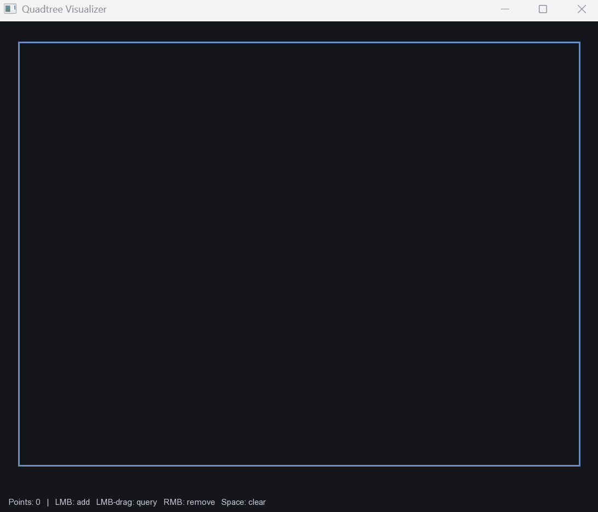

# quadtree-visualiser

A C++ quadtree for 2D spatial partitioning, with live SFML visualisation of 
subdivision, insertion, removal, and range queries.

## Overview

Three components, each in its own file:

| File | Purpose |
|---|---|
| `src/AABB.{h,cpp}` | Axis-aligned bounding box, plus `contains` and `intersects` |
| `src/Point.h` | A single point in world space, with an auto-assigned id |
| `src/QuadTree.{h,cpp}` | The quadtree: insert, query, remove, clear |
| `src/Visualizer.{h,cpp}` | SFML 3 window with interactive drawing and query |

## Visualizer

The window shows the quadtree's leaf cells in real time:

- **Left-click** — insert a point
- **Left-drag** — draw a query rectangle; matching points turn gold
- **Right-click** — remove the nearest point
- **Q** or **Esc** — clear the query
- **Space** — clear everything

Only leaf cells are drawn. When a cell exceeds its capacity (default 4), it 
subdivides into four children and its points are redistributed.

## Build

Requires **MSYS2 UCRT64** with `g++` and the `mingw-w64-ucrt-x86_64-sfml` package.

    pacman -S mingw-w64-ucrt-x86_64-sfml

Build:

    g++ -std=c++17 -O2 -Wall -Wextra
        src/main.cpp src/QuadTree.cpp src/Visualizer.cpp
        -I src -IC:/msys64/ucrt64/include
        -o viz.exe
        -lsfml-graphics -lsfml-window -lsfml-system

Run:

    ./viz.exe

## Design Notes

**Half-open intervals.** `AABB::contains` uses `[x, x+w)` on both axes. Points
on the left or top edge are inside, points on the right or bottom edge are 
outside. This ensures every point falls into exactly **one** child, so internal 
nodes are always empty, query never sees duplicates, and remove traverses a single
path.

**No merging on removal.** When a leaf's point count drops, its parent is not
collapsed back into a single leaf. This is a design choice to avoid added 
complexity for merging.

**Ownership of `Point*`.** The tree stores pointers to `Point` objects but does
not own them. `destroySubtree` frees `QuadNode`s only; the visualizer owns the 
actual points and cleans them up when it clears. This keeps the tree focused on 
spatial indexing rather than memory management.

**Query pruning.** `queryHelper` returns immediately if a node's bounds don't
intersect the query range. Each comparison skips an entire subtree, which is why
quadtrees are so fast.